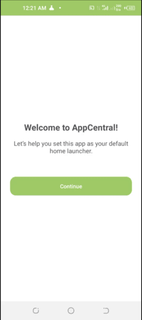
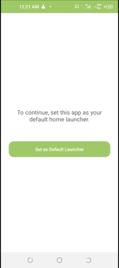
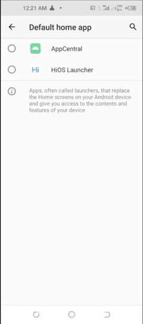
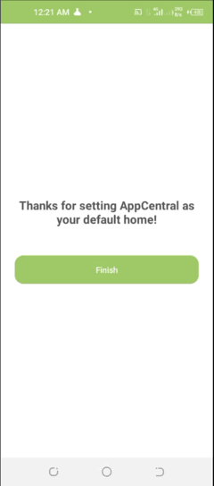
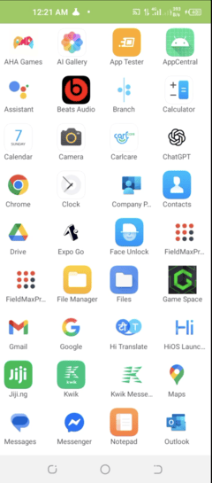

# App Central ReadMe

App Central is an Android exercise project demonstrating how to develop a default home app. It features a minimal onboarding UI to guide the user through setting the app as their default launcher and handles various edge cases for a smooth user experience. This guide provides everything you need to know to get started with the project.

## Table of Contents

- [Project Goal](#project-goal)
- [Features](#features)
- [Screenshots (Conceptual)](#screenshots-conceptual)
- [Technologies Used](#technologies-used)
- [Installation](#installation)
  - [Prerequisites](#prerequisites)
  - [Clone the Repository](#clone-the-repository)
  - [Open in Android Studio](#open-in-android-studio)
  - [Build and Run](#build-and-run)
- [Usage](#usage)
  - [Onboarding Flow](#onboarding-flow)
  - [Home Activity](#home-activity)
- [Edge Cases Handled](#edge-cases-handled)
- [Contributing](#contributing)
- [License](#license)

## Project Goal

This project serves as an exercise to:

-   Learn how to develop a default home app for Android devices.
-   Build a minimal onboarding UI that allows the user to change their default home app.
-   Think and deal with various edge cases for a robust user experience.

## Features

Key features and functionalities of App Central:

-   **Default Home App Capability:** App Central can be set as the default home screen launcher on an Android device.
-   **Home Activity:** A basic activity that serves as the main screen once App Central is set as the default home app.
-   **Multi-Step Onboarding UI (using Fragments):**
    -   **Step 1 (Welcome):** Displays a welcome message and a "Continue" button.
    -   **Step 2 (Set Default Home):** Guides the user to set App Central as the default home app via the system UI. It intelligently handles cases where the user does or does not set the app as default.
    -   **Step 3 (Thank You):** Confirms successful setup and allows the user to finish onboarding.
-   **Seamless Onboarding Flow:** Ensures the user remains in the onboarding activity until completion, even when interacting with system dialogs.
-   **Verbose Logging:** Implemented throughout the application for easier debugging and understanding the flow.

### Screenshots






## Technologies Used

-   **Kotlin:** Primary programming language for Android development.
-   **XML:** Used for designing UI layouts (Views).
-   **Android Fragments:** Utilized for displaying different UI steps within the Onboarding Activity.
-   **Android SDK:** Core Android development tools and APIs for home screen and activity lifecycle management.

## Installation

Follow these steps to install and run App Central on your system.

### Prerequisites

Before you begin, ensure you have the following installed:

-   <a href="https://developer.android.com/studio" target="_blank">Android Studio</a> (latest stable version recommended)
-   An Android device or emulator (API level suitable for home app development, e.g., API 21+).

### Clone the Repository

1.  Open your terminal or command prompt.
2.  Use the following command to clone the App Central repository (replace with your actual repository URL if different):

    ```bash
    git clone https://github.com/jayhymn/app-central.git
    ```

### Open in Android Studio

1.  Change your working directory to the cloned repository:

    ```bash
    cd app-central
    ```

2.  Open Android Studio.
3.  Select "Open an existing Android Studio project" (or "File" > "Open...") and navigate to the `app-central` directory.
4.  Android Studio will automatically sync the project with Gradle and download necessary dependencies.

### Build and Run

1.  Connect your physical Android device (with USB debugging enabled) or start an Android Virtual Device (Emulator).
2.  Select the target device from the toolbar in Android Studio.
3.  Click the "Run 'app'" button (green play icon) in Android Studio.
    Alternatively, you can build from the terminal:
    -   For a debug APK: `./gradlew assembleDebug` (or `gradlew.bat assembleDebug` on Windows)
    -   To install debug APK: `./gradlew installDebug`

## Usage

### Onboarding Flow

1.  Upon launching the app for the first time (or if onboarding hasn't been completed), the Onboarding Activity will start.
2.  **Step 1:** Read the welcome text and click "Continue".
3.  **Step 2:** Read the guidance. Click "Continue" to open the system dialog for changing the default home app.
    -   Select "App Central" from the list and confirm.
    -   If you return without setting App Central as default, you'll remain on Step 2.
    -   If you successfully set App Central as default, you will automatically proceed to Step 3.
4.  **Step 3:** Read the "Thank You" message and click "Continue". The onboarding activity will finish.

### Home Activity

-   Once App Central is set as the default home app (either through onboarding or system settings), pressing the device's home button will launch App Central's Home Activity.
-   The Home Activity in this exercise is minimal, serving as a placeholder for a functional launcher.

## Edge Cases Handled

The application is designed to manage the following edge cases:

1.  **Configuration Changes:** User state (current onboarding step) is preserved during screen rotations or other configuration changes.
2.  **System-Initiated Process Death:** The app attempts to restore the user to the correct onboarding step if the process is killed and restarted by the system.
3.  **Starting Onboarding When Already Default:** If the onboarding activity is launched when App Central is already the default home app, the onboarding activity will automatically finish.
4.  **External Default Home App Change:** If the user sets App Central as the default home app through system settings (not via Step 2's "Continue" button) while the onboarding activity was in the background, returning to the onboarding activity will automatically advance it to Step 3.

## Contributing

While this is primarily an exercise project, contributions or suggestions are welcome! Please feel free to submit a pull request or create an issue for feedback and suggestions if this were a collaborative project. For this exercise, focus on fulfilling the requirements.
---

Thank you for checking out App Central! If this were a public project and you encountered any issues or have suggestions, you would [create an issue](https://github.com/jayhymn/app-central/issues) (replace with your actual repo URL).
